# Model catalog

The `com.kniazkov.widgets.model` package contains the reactive state layer of the framework. A
model owns or derives one non-null value, reports whether that value is valid, and notifies
listeners when its observable state changes. Widgets bind these models to view properties, while
controllers update them in response to browser events.

This document covers every model type currently present in the package. `Binding` is summarized
separately because it connects a model to a listener but is not itself a model.

## Model contract

Every `Model<T>` provides the same core operations:

- `getData()` returns a usable, non-null value even when `isValid()` is `false`.
- `setData(value)` returns `true` only when the implementation accepts and changes the value;
  read-only models return `false`.
- listeners are notified synchronously. `SingleThreadModel` stores them as weak keys so an
  otherwise unreachable listener does not stay alive only because it subscribed to a model.
- `deriveWithData(value)` creates a separate model with comparable behavior and new initial data.
- models are not thread-safe by default. Cross-thread access must go through `SynchronizedModel`.

`Model` also supplies `getValidFlagModel()`, `asCascading()`, `asSynchronized()`, and the guarded
untyped update method `setObject(Object)`.

## Class hierarchy

The arrows below represent Java inheritance or interface implementation. They do not show which
models wrap or observe other models; those relationships are described later.

```mermaid
classDiagram
    direction TB

    class Model {
        <<interface>>
    }
    class SingleThreadModel {
        <<abstract>>
    }
    class DefaultModel {
        <<abstract>>
    }
    class ReadOnlyModel {
        <<abstract>>
    }

    Model <|.. SingleThreadModel
    Model <|.. SynchronizedModel

    SingleThreadModel <|-- DefaultModel
    SingleThreadModel <|-- ReadOnlyModel
    SingleThreadModel <|-- EmailModel
    SingleThreadModel <|-- CascadingModel
    SingleThreadModel <|-- InvertModel
    SingleThreadModel <|-- IntegerToStringModel
    SingleThreadModel <|-- RealToStringModel

    ReadOnlyModel <|-- ValidFlagModel
    ReadOnlyModel <|-- PredicateModel
    ReadOnlyModel <|-- ConjunctionModel
    ReadOnlyModel <|-- DisjunctionModel

    DefaultModel <|-- StringModel
    DefaultModel <|-- NotEmptyStringModel
    DefaultModel <|-- UsernameModel
    DefaultModel <|-- PhoneNumberModel
    DefaultModel <|-- BooleanModel
    DefaultModel <|-- IntegerModel
    DefaultModel <|-- ValidatedIntegerModel
    DefaultModel <|-- RealNumberModel
    DefaultModel <|-- ValidatedRealNumberModel
    DefaultModel <|-- UuidModel
    DefaultModel <|-- ColorModel
    DefaultModel <|-- OffsetModel
    DefaultModel <|-- AbsoluteSizeModel
    DefaultModel <|-- WidgetSizeModel
    DefaultModel <|-- FontFaceModel
    DefaultModel <|-- FontSizeModel
    DefaultModel <|-- FontWeightModel
    DefaultModel <|-- BorderStyleModel
    DefaultModel <|-- HorizontalAlignmentModel
    DefaultModel <|-- VerticalAlignmentModel
    DefaultModel <|-- ImageSourceModel
    DefaultModel <|-- SvgImageSourceModel
```



## Core abstractions and helper

| Type | Purpose |
| --- | --- |
| `Model<T>` | Reactive value contract: validation, reads, writes, listener management, derivation, and convenience wrappers. |
| `SingleThreadModel<T>` | Base implementation of weak listener registration and synchronous notification. It deliberately adds no locking. |
| `DefaultModel<T>` | Mutable in-memory base. Values are compared with `equals`; a changed value is stored and emitted. `create(Object)` recognizes `String`, `Integer`, `Double`, `Boolean`, `Color`, and `UUID`. |
| `ReadOnlyModel<T>` | Base that rejects writes. `create(value)` returns an always-valid immutable model for the supplied value. |
| `Binding<T>` | Non-model helper that immediately sends the current value to a listener, subscribes it, and safely moves that listener when the bound model is replaced. |

## General-purpose and validated value models

| Model | Data and default | Validation and behavior |
| --- | --- | --- |
| `StringModel` | `String`, default `""` | Always valid mutable text. |
| `NotEmptyStringModel` | `String`, default `""` | Valid when the trimmed value is not empty. |
| `UsernameModel` | `String`, default `""` | Valid when the trimmed value is non-empty and contains no space character. |
| `EmailModel` | `String`, default `""` | Validates a practical UI-oriented email pattern; it intentionally does not attempt complete RFC 5322 validation. |
| `PhoneNumberModel` | `String`, default `""` | Valid only for `+` followed by 8 to 15 digits. |
| `BooleanModel` | `Boolean`, default `false` | Always valid; `invert()` creates an `InvertModel`. |
| `IntegerModel` | `Integer`, default `0` | Always valid integer storage. |
| `ValidatedIntegerModel` | `Integer`, default `0` | Uses a caller-supplied `Criterion`; includes `NOT_NEGATIVE` and `POSITIVE`. Derived instances retain the criterion. |
| `RealNumberModel` | `Double`, default `0.0` | Always valid double-precision storage. |
| `ValidatedRealNumberModel` | `Double`, default `0.0` | Uses a caller-supplied `Criterion`; includes `NOT_NEGATIVE`, `POSITIVE`, and `UNIT_INTERVAL`. Derived instances retain the criterion. |
| `UuidModel` | `UUID`, default internal sentinel | The no-argument model starts invalid; any UUID other than the sentinel is valid. |

Validation does not block storage: validated models may hold an invalid value, expose it through
`getData()`, and report the condition through `isValid()` and `getValidFlagModel()`.

## View and media value models

| Model | Data type | Default and special behavior |
| --- | --- | --- |
| `ColorModel` | `Color` | `Color.BLACK` |
| `OffsetModel` | `Offset` | `Offset.UNDEFINED` |
| `AbsoluteSizeModel` | `AbsoluteSize` | `AbsoluteSize.UNDEFINED`; also parses CSS-style absolute sizes such as `24px` or `10pt`. |
| `WidgetSizeModel` | `WidgetSize` | `AbsoluteSize.UNDEFINED`; also parses absolute or relative CSS-style sizes, including percentages. |
| `FontFaceModel` | `FontFace` | `FontFace.DEFAULT` |
| `FontSizeModel` | `FontSize` | `FontSize.DEFAULT`; also parses CSS-style font sizes. |
| `FontWeightModel` | `FontWeight` | `FontWeight.NORMAL` |
| `BorderStyleModel` | `BorderStyle` | `BorderStyle.NONE` |
| `HorizontalAlignmentModel` | `HorizontalAlignment` | `HorizontalAlignment.LEFT` |
| `VerticalAlignmentModel` | `VerticalAlignment` | `VerticalAlignment.TOP` |
| `ImageSourceModel` | `ImageSource` | `ImageSource.INVALID` |
| `SvgImageSourceModel` | `SvgImageSource` | `SvgImageSource.EMPTY`, an empty valid SVG source. |

All models in this section extend `DefaultModel`, are always valid at the model layer, and preserve
their concrete type when derived. Domain objects such as `ImageSource.INVALID` or an undefined
size may still carry their own sentinel meaning.

## Composed, derived, and adapter models

| Model | Access | Purpose |
| --- | --- | --- |
| `CascadingModel<T>` | Read-write | Follows a base model until the first local write. That write derives a private model, after which later base updates no longer affect the cascade. Useful for inherited styles and configuration overrides. |
| `SynchronizedModel<T>` | Read-write | Serializes access to a replaceable base model with a `ReentrantLock`, snapshots listeners, and invokes callbacks after releasing the lock. Derived models remain synchronized, and late callbacks from an old base are discarded. |
| `InvertModel` | Read-write | Exposes the logical negation of a boolean base. Reads and emitted values are inverted; writes are inverted before delegation. |
| `ConjunctionModel` | Read-only | Reactive logical AND over multiple boolean models. Its data is true only when all inputs are true, and it is valid only when all inputs are valid. |
| `DisjunctionModel` | Read-only | Reactive logical OR over multiple boolean models. Its data is true when any input is true, and it is valid when at least one input is valid. |
| `ValidFlagModel<T>` | Read-only | Exposes `base.isValid()` as boolean data. The flag model itself is always valid and emits when the base notifies. |
| `PredicateModel<T>` | Read-only | Caches `base.isValid() && predicate.test(base.getData())` as boolean data and emits only when that result changes. The predicate model itself is always valid. |
| `IntegerToStringModel` | Read-write adapter | Presents an integer base as editable text. Valid text updates the base; unparsable text remains visible and makes the adapter invalid without changing the base. An external base update restores valid numeric text. |
| `RealToStringModel` | Read-write adapter | The same two-way text adaptation for a `Double` base. It preserves the caller's exact valid text during its own write, instead of immediately replacing it with `Double.toString`. |

`SynchronizedModel` protects operations performed through the wrapper. `getBase()` returns the raw
underlying model, so callers that mutate that object directly from other threads bypass the
wrapper's synchronization guarantee.

## Common composition patterns

```java
Model<String> email = new EmailModel();
Model<Boolean> canSubmit = new ConjunctionModel(
    email.getValidFlagModel(),
    new BooleanModel(true)
);

Model<String> inheritedLabel = new StringModel("Default").asCascading();
SynchronizedModel<Integer> counter = new IntegerModel().asSynchronized();
Model<String> editableCounter = new IntegerToStringModel(counter);
```

Wrappers subscribe to their bases and re-emit derived state, so retaining the same model instance
is important for stable bindings. Use `Binding.setModel(...)` when a consumer intentionally needs
to switch from one model object to another.
