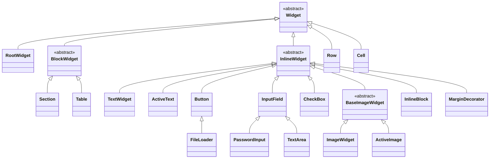

# Widget catalog

The `com.kniazkov.widgets.view` package contains the server-side view tree. Every actual UI
widget extends `Widget`, owns a unique ID and a style, binds reactive models to properties, and
queues protocol updates for the browser. A widget may also expose controllers for browser events.

This document covers every widget class currently present in the package. Styles, property
mixins, and upload helper objects are summarized separately because they are not widgets.

## Class hierarchy

The arrows below represent Java inheritance, not parent-child containment in a rendered UI.

`RootWidget`, `Row`, and `Cell` extend `Widget` directly because their placement is governed by
the root and table structures rather than the general block/inline distinction.

## Abstract widget classes

| Class | Purpose |
| --- | --- |
| `Widget<S extends Style>` | Base of the entire view hierarchy. Owns identity, parent linkage, style bindings, event controllers, and pending browser updates. |
| `BlockWidget<S extends Style>` | Marker base for widgets that participate in block-level layout. |
| `InlineWidget<S extends Style>` | Marker base for widgets that participate in inline layout. |
| `BaseImageWidget<S extends Style>` | Shared inline base for images, including border, margin, absolute size, and opacity properties. |

## Root and layout widgets

| Widget | Client type | Allowed children | Purpose |
| --- | --- | --- | --- |
| `RootWidget` | `root` | `BlockWidget` | Top-level UI root created for a client. It cannot have a parent, can reset the client, and can request navigation to another page. |
| `Section` | `section` | `InlineWidget` | Block-level horizontal flow, similar to a paragraph or generic HTML block containing inline content. Supports alignment, margin, padding, and hidden state. |
| `InlineBlock` | `inline block` | `BlockWidget` | Inline-positioned container for block-level content. Supports background, border, size, spacing, and pointer events. |
| `MarginDecorator` | `margin decorator` | One `InlineWidget` | Wraps a single inline widget to add margin support without changing the wrapped widget. Removing its child installs an empty `TextWidget`. |

## Text, input, and action widgets

| Widget | Client type | Purpose |
| --- | --- | --- |
| `TextWidget` | `text` | Displays styled text backed by a string value or `Model<String>`. |
| `ActiveText` | `active text` | Interactive styled text with normal, hovered, and active visual states plus pointer events. |
| `Button` | `button` | Clickable decorator around one `InlineWidget`; text constructors create a `TextWidget` child. Supports disabled and hidden states. |
| `FileLoader` | `file loader` | Specialized `Button` that accepts one or multiple files, receives uploads in chunks, filters accepted file types, and reports each selected `UploadingFile`. |
| `InputField` | `input field` | Single-line editable text input. Binding a text model also binds the field's invalid state to the model's validity flag. |
| `PasswordInput` | `password input` | `InputField` variant rendered as a password input while retaining the same model and style API. |
| `TextArea` | `text area` | Multi-line `InputField` variant for longer text. |
| `CheckBox` | `checkbox` | Boolean selection control rendered from configurable selected and unselected images. Supports pointer and disabled states. |

## Image widgets

| Widget | Client type | Purpose |
| --- | --- | --- |
| `ImageWidget` | `image` | Displays an `ImageSource` or hyperlink through a reactive image-source model. |
| `ActiveImage` | `active image` | Interactive image with separate source models for normal, hovered, and active states. A shared source may be applied to all states. |

## Table widgets

| Widget | Client type | Allowed children | Purpose |
| --- | --- | --- | --- |
| `Table` | `table` | `Row` | Block-level table. Missing rows and cells can be created on demand through `getRow` and `getCell`; default row and cell styles apply to newly created elements. |
| `Row` | `row` | `Cell` | Table row with pointer-aware visual states. `getCell` grows the row on demand and uses the parent table's column-specific defaults when available. |
| `Cell` | `cell` | `BlockWidget` | Table cell that hosts block content and supports background, border, size, padding, alignment, and pointer events. |

## Containment rules

Inheritance determines layout category, while container interfaces determine which children are
legal. The supported tree shapes are:

- `RootWidget` -> `BlockWidget`
- `Section` -> `InlineWidget`
- `InlineBlock` -> `BlockWidget`
- `Button` and `MarginDecorator` -> exactly one `InlineWidget`
- `Table` -> `Row` -> `Cell` -> `BlockWidget`

Adding a widget to a new container updates its parent and queues the corresponding protocol
operation. Removing it detaches it from the tree. A detached subtree keeps its state and is
re-emitted with fresh update IDs when attached again.

## Styles and reactive properties

Each concrete widget has a matching style type or reuses its parent's style. Default styles are
available through `getDefaultStyle()`, and derived styles inherit reactive property models from
their parent. Properties are exposed by capability interfaces such as `HasColor`, `HasBorder`,
`HasStyledText`, and `HasDisabledState`; setters can bind either a value or a `Model` so later model
changes are synchronized to the browser automatically.

## Related view types that are not widgets

| Type | Role |
| --- | --- |
| `Container`, `TypedContainer`, `BlockContainer` | Define ownership, traversal, and child-type constraints for widget containers. |
| `Decorator` | Defines a container that owns exactly one decorated child. |
| `Style`, `Property`, `State` | Describe reactive appearance and state-dependent behavior. They do not create view-tree nodes. |
| `Column` | Logical view over cells at one table column index. It is not present in the widget or browser hierarchy. |
| `UploadingFile` | Tracks chunk assembly, metadata, completion, and progress for a file selected through `FileLoader`. |
