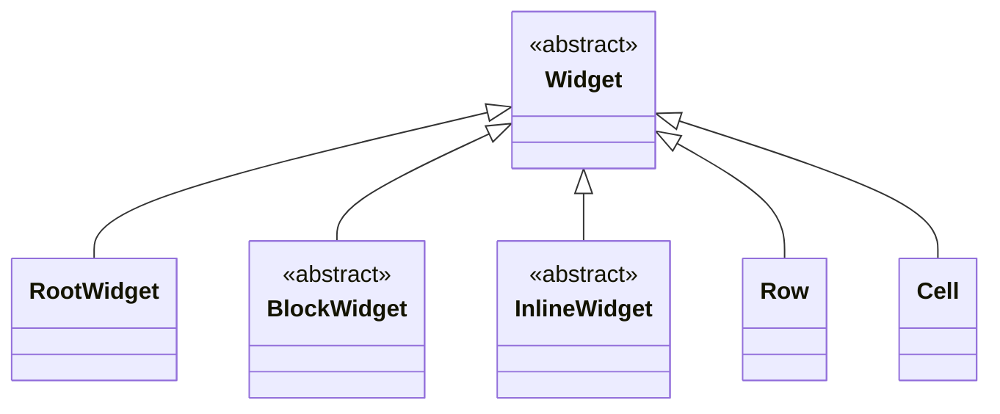
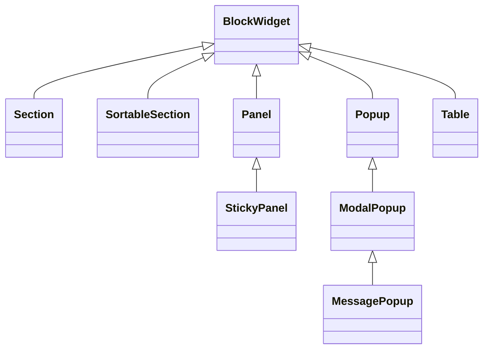
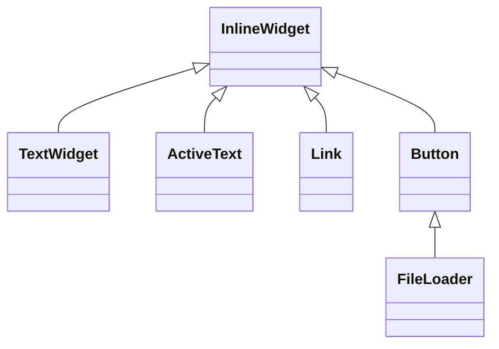
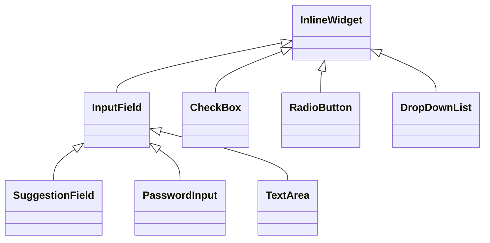
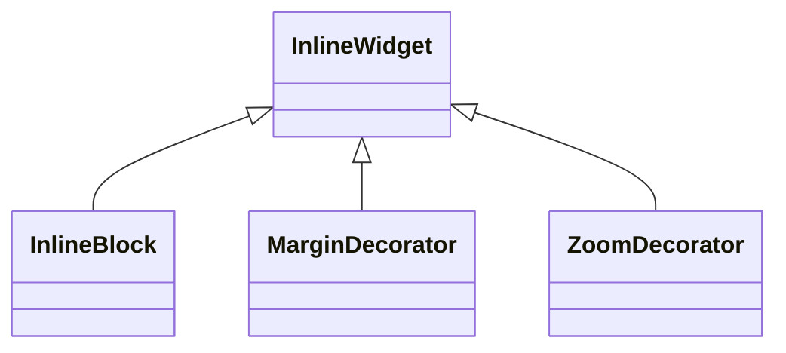
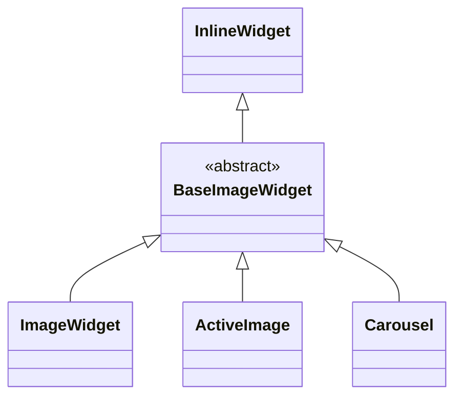

# Widget catalog

The `com.kniazkov.widgets.view` package contains the server-side view tree. Every actual UI
widget extends `Widget`, owns a unique ID and a style, binds reactive models to properties, and
queues protocol updates for the browser. A widget may also expose controllers for browser events.

This document covers every widget class currently present in the package. Styles, property
mixins, and upload helper objects are summarized separately because they are not widgets.

## Class hierarchy

The arrows below represent Java inheritance, not parent-child containment in a rendered UI.



Block widgets:



Inline text and action widgets:



Inline input widgets:



Inline containers and decorators:



Inline image widgets:



`RootWidget`, `Row`, and `Cell` extend `Widget` directly because their placement is governed by
the root and table structures rather than the general block/inline distinction.

## Abstract widget classes

| Class | Purpose |
| --- | --- |
| `Widget<S extends Style>` | Base of the entire view hierarchy. Owns identity, parent linkage, style bindings, event controllers, and pending browser updates. |
| `BlockWidget<S extends Style>` | Marker base for widgets that participate in block-level layout. |
| `InlineWidget<S extends Style>` | Marker base for widgets that participate in inline layout. |
| `BaseImageWidget<S extends Style>` | Shared inline base for images, including border, margin, absolute size, and opacity properties. |

## Root and layout widgets

| Widget | Client type | Allowed children | Purpose |
| --- | --- | --- | --- |
| `RootWidget` | `root` | `BlockWidget` | Top-level UI root created for a client. It cannot have a parent, can reset the client, and can request navigation to another page. |
| `Section` | `section` | `InlineWidget` | Block-level horizontal flow, similar to a paragraph or generic HTML block containing inline content. Supports alignment, margin, padding, and hidden state. |
| `Panel` | `panel` | `BlockWidget` | General-purpose block container for composing nested page regions. Supports background, border, size, spacing, and pointer events. |
| `StickyPanel` | `sticky panel` | `BlockWidget` | Block container that remains in normal document flow, then sticks to the configured top or bottom viewport edge during scrolling. Its sticky side is reactive. |
| `InlineBlock` | `inline block` | `BlockWidget` | Inline-positioned container for block-level content. Supports background, border, size, spacing, and pointer events. |
| `Popup` | `popup` | `BlockWidget` | Non-modal window fixed to the viewport. Its width, height, horizontal alignment, and vertical alignment are reactive. |
| `ModalPopup` | `modal popup` | `BlockWidget` | Popup with a full-screen interaction-blocking backdrop. The backdrop color and optional outside-click dismissal are exposed through models. Outside dismissal is disabled by default and supports mouse clicks and touch taps. |
| `MessagePopup` | `modal popup` | `BlockWidget` | Ready-to-use modal message composed from a string or caller-supplied `TextWidget` and one or two buttons. The text widget is exposed for later style and model changes. |
| `MarginDecorator` | `margin decorator` | One `InlineWidget` | Wraps a single inline widget to add margin support without changing the wrapped widget. Removing its child installs an empty `TextWidget`. |

All multi-child containers provide varargs constructors for declarative tree construction. Style
overloads accept the style first and children after it; `TypedContainer.addAll(Iterable)` handles
dynamic collections while preserving iteration order.

## Text, input, and action widgets

| Widget | Client type | Purpose |
| --- | --- | --- |
| `TextWidget` | `text` | Displays styled text backed by a string value or `Model<String>`. |
| `ActiveText` | `active text` | Interactive styled text with normal, hovered, and active visual states plus pointer events. |
| `Link` | `link` | Text hyperlink rendered as an HTML `a` element. Its reactive `href` model defaults to `#`; it supports pointer and focus events. |
| `Button` | `button` | Clickable decorator around one `InlineWidget`; text constructors create a `TextWidget` child, while widget constructors accept any inline child. Supports disabled and hidden states. |
| `FileLoader` | `file loader` | Specialized `Button` that accepts one or multiple files, receives uploads in chunks, filters accepted file types, and reports each selected `UploadingFile`. |
| `InputField` | `input field` | Single-line editable text input. Binding a text model also binds the field's invalid state to the model's validity flag. Implements `HasHorizontalAlignment`, so its text can be aligned left, center, right, or justified. |
| `SuggestionField` | `suggestion field` | Editable text with a reactive list of optional suggestions, substring filtering, touch selection and keyboard navigation. Arbitrary new values are allowed. |
| `PasswordInput` | `password input` | `InputField` variant rendered as a password input while retaining the same model and style API. |
| `TextArea` | `text area` | Multi-line `InputField` variant for longer text. |
| `CheckBox` | `checkbox` | Boolean selection control rendered from configurable selected and unselected images. Supports pointer and disabled states. |
| `RadioButton` | `radio button` | Boolean selection control that can be selected, but cannot be cleared by another user click. Application code can clear it through its checked-state model; `RadioGroup` provides mutual exclusion. |
| `DropDownList` | `drop down list` | Native HTML selection control with a fixed number of ordered `Model<String>` option labels, a reactive selected-index model, keyboard focus, and disabled state. |

## Image widgets

| Widget | Client type | Purpose |
| --- | --- | --- |
| `ImageWidget` | `image` | Displays an `ImageSource` or hyperlink through a reactive image-source model. Supports independent maximum width and height. |
| `ActiveImage` | `active image` | Interactive image with separate source models for normal, hovered, and active states. A shared source may be applied to all states. |
| `Carousel` | `carousel` | Non-circular, swipeable image sequence backed by a fixed non-empty array of reactive `ImageSource` models. It reports clicks and successful selection changes. |

`Carousel` starts at index zero and exposes its position through `getSelectedIndexModel()`.
Applications may observe successful swipes with `onSelect(...)` and taps with `onClick(...)`.
At either end, an outward swipe is resisted and returns to the same image instead of wrapping.
The source count and order are fixed; `setSource(...)` and `setSourceModel(...)` update an existing
position reactively.

## Table widgets

| Widget | Client type | Allowed children | Purpose |
| --- | --- | --- | --- |
| `Table` | `table` | `Row` | Block-level table. Missing rows and cells can be created on demand through `getRow` and `getCell`; `insertRow` inserts a new or unattached row at any valid position, and `removeRow` removes a row by index. Default row and cell styles apply to newly created elements. |
| `Row` | `row` | `Cell` | Table row with pointer-aware visual states. `getCell` grows the row on demand and uses the parent table's column-specific defaults when available. |
| `Cell` | `cell` | `BlockWidget` | Table cell that hosts block content and supports background, border, size, padding, alignment, and pointer events. |

## Sortable and zoomable inline content

| Widget | Client type | Allowed children | Purpose |
| --- | --- | --- | --- |
| `SortableSection` | `sortable section` | `InlineWidget` | Wrapping block container with mouse/touch dragging, Alt+Left/Right reordering, versioned server synchronization and `onReorder` callbacks. The dragged child follows the pointer above its siblings; on release, children animate to their new positions. |
| `ZoomDecorator` | `zoom decorator` | One `InlineWidget` | Clips arbitrary inline content and provides wheel/pinch zoom, bounded panning, a configurable scale limit and reset. Removing the child installs an empty `TextWidget`. |

`SortableSection.setAnimationDuration(milliseconds)` controls settling animations: the default is
250 ms; 0 disables them. Pointer tracking has no animation delay. Keyboard and programmatic moves
use the same duration. Browsers requesting reduced motion settle immediately.

`SortableSectionStyle.DEFAULT` stores `Property.ANIMATION_DURATION` (250 ms), and
`ZoomDecoratorStyle.DEFAULT` stores `Property.MAX_SCALE` (8.0). Both are reactive models at
`State.ANY`, accessible through value and model getters/setters on the widget and its style.
Derived styles inherit changes until locally overridden; replacing models or calling `setStyle`
uses the standard framework bindings.

`ZoomDecorator.setFitContent(true)` optionally fits and centers the whole child in its viewport,
including after image loading or viewport resizing. Zoom limits then apply relative to the fitted
view. The setting is model-backed and defaults to false; see [gesture widgets](GESTURE-WIDGETS.md).

See [gesture widgets](GESTURE-WIDGETS.md) for API examples, interaction details, and the two
standalone demonstrations. Both widgets also appear in `AllWidgets`.

## Containment rules

Inheritance determines layout category, while container interfaces determine which children are
legal. The supported tree shapes are:

- `RootWidget` -> `BlockWidget`
- `Section` and `SortableSection` -> `InlineWidget`
- `Panel`, `StickyPanel`, `InlineBlock`, `Popup`, `ModalPopup`, `MessagePopup`, and `Cell`
  -> `BlockWidget`
- `Button`, `MarginDecorator`, and `ZoomDecorator` -> exactly one `InlineWidget`
- `Table` -> `Row` -> `Cell`

Adding a widget to a new container updates its parent and queues the corresponding protocol
operation. Removing it detaches it from the tree. A detached subtree keeps its state and is
re-emitted with fresh update IDs when attached again.

## Styles and reactive properties

Each concrete widget has a matching style type or reuses its parent's style. Default styles are
available through `getDefaultStyle()`, and derived styles inherit reactive property models from
their parent. Properties are exposed by capability interfaces such as `HasColor`, `HasBorder`,
`HasStyledText`, and `HasDisabledState`; setters can bind either a value or a `Model` so later model
changes are synchronized to the browser automatically.

## Related view types that are not widgets

| Type | Role |
| --- | --- |
| `Container`, `TypedContainer`, `BlockContainer` | Define ownership, traversal, and child-type constraints for widget containers. |
| `Decorator` | Defines a container that owns exactly one decorated child. |
| `Style`, `Property`, `State` | Describe reactive appearance and state-dependent behavior. They do not create view-tree nodes. |
| `Column` | Logical view over cells at one table column index. It is not present in the widget or browser hierarchy. |
| `UploadingFile` | Tracks chunk assembly, metadata, completion, and progress for a file selected through `FileLoader`. |
| `RadioGroup` | Observes the checked-state models of its `RadioButton` members and ensures that selecting one clears all others. It is `AutoCloseable`; closing it removes its model subscriptions. |

## Selection controls

`RadioButton` uses the same reactive checked-state model as `CheckBox`, but a browser click can
only select it. Clearing remains available to application code through `uncheck()` or the model.
Place related buttons in a `RadioGroup`; selecting any member then clears the other members.

`DropDownList` wraps the browser's native `select` element. Each option position contains a
`Model<String>` that controls its visible text. The number and order of positions are fixed by the
constructor: application code may change a model's value with `setOptionText(...)`, or replace the
model at an existing position with `setOptionModel(...)`, but cannot insert or remove positions.
The string and string-collection constructors remain available and create independent
`StringModel` instances automatically.

`getSelectedIndexModel()` exposes the selected position. Index `-1` means that no option is
selected; every non-negative value refers to the same position for the lifetime of the widget.
`onSelect(...)` receives that index after the model has been updated. This deliberate fixed-size
contract prevents a selection from silently changing meaning because options were inserted,
removed, or reordered.

The drop-down list is intentionally not a widget container. Native options are text choices and
provide standard keyboard and accessibility behavior. A popup that hosts arbitrary inline widgets
would require a separate composite control with its own focus and navigation rules.


### Maximum width

Widgets and styles with `HasWidth` or `HasAbsoluteWidth` also expose `HasMaxWidth`.
Use `input.setMaxWidth("100%")` to keep a preferred fixed width inside its container.
`setMaxWidth("")` clears the limit. The limit has its own reactive model and does not
change the preferred width. Use border-box sizing and account for external margins.

## Bounding images without changing their proportions

`HasHeight` and `HasAbsoluteHeight` inherit `HasMaxHeight`, just as width interfaces
inherit `HasMaxWidth`. Widgets and styles expose `setMaxHeight(int)`,
`setMaxHeight(String)`, `setMaxHeight(WidgetSize)` and a reactive maximum-height model.
The limit is independent of the preferred height; an empty string clears it.
No maximum is imposed by default. Protocol updates use `set max height`.

For a logo, leave both preferred dimensions undefined and set upper bounds:

```java
final ImageWidget logo = new ImageWidget("logo/brand.svg");
logo.setMaxWidth(480);
logo.setMaxHeight(180);
```

The browser preserves the intrinsic image ratio and fits the image within 480 × 180
CSS pixels. This works for PNG and SVG with intrinsic proportions (for SVG, supply a
valid `viewBox`). Limits do not force a smaller raster image to grow. Setting both
preferred width and height explicitly is a different operation and may distort an image.

For a narrow parent, use a container with preferred width 480 and maximum width `100%`,
then set the image maximum width to `100%` and maximum height to 180. This lets it shrink
with the available space. Percentage maximum heights need a definite parent height;
use pixels when the parent height follows its contents. Existing fixed-size images keep
their behavior until a limit is explicitly set.

### Closing a modal by clicking or tapping outside

`ModalPopup` and `MessagePopup` can remove themselves from the widget tree when their backdrop
is clicked or tapped. Clicks inside the popup leave it open. The setting defaults to `false`
in `ModalPopupStyle.DEFAULT`, preserving explicit button-based closing.

```java
final Button ok = new Button("OK");
final MessagePopup popup = new MessagePopup("Click or tap outside to close", ok);
ok.onClick(event -> popup.remove());
popup.setCloseOnOutsideClick(true);
root.add(popup);
```

Use `getCloseOnOutsideClickModel()` or `setCloseOnOutsideClickModel(Model<Boolean>)` to bind the
setting to application state; changes take effect while the popup is open. The dedicated
`Property.CLOSE_ON_OUTSIDE_CLICK` also supports configuration through `ModalPopupStyle`.
The server checks the current setting before removing the popup and its backdrop.
`AllWidgets` demonstrates a dismissible message with a checkbox bound to this model.

## Editable suggestions

`SuggestionField` extends `InputField`. It preserves text binding, validation, disabled state,
focus and text-input events. `SuggestionFieldStyle` inherits standard input styling; the list
uses the field's font, colors and border.

Like `DropDownList`, it accepts **existing `Model<String>` instances**, including models
provided by database records. Each suggestion retains its original model reference and
subscribes to changes; no intermediate list-value model or text copies are needed in the API.

```java
final SuggestionField field = new SuggestionField(List.of(
    firstProperty.getTextModel(), secondProperty.getTextModel()
));
field.setTextModel(productValue);
```

The constructor accepts `Iterable<Model<String>>`, optionally after a `SuggestionFieldStyle`.
Convenience constructors accepting strings create `StringModel` instances, like `DropDownList`.
`getSuggestionModels()` returns an immutable snapshot of the model references;
`getSuggestionModel(index)` and `setSuggestionModel(index, model)` expose individual bindings.
`setSuggestionModels(models)` replaces the list, for example after querying newly saved records.
It copies only the collection structure and detaches listeners from old models. Later structural
changes to the supplied collection require another call; changes to the models update the UI
automatically. Empty lists are allowed; null models are rejected.

The editable `Property.TEXT` model is independent of the source suggestion models. Choosing a
suggestion copies its current text into that model; it does not rebind the field or write back
to a source record. Read-only suggestion models are supported. Updating, reordering or removing
suggestions never changes already entered text.

Focus or click opens matching suggestions. An empty field shows all values; typing filters
by case-insensitive substring. Blank entries and exact duplicates are omitted from the
visible list without modifying the model. Arrow keys move the highlight; Enter chooses it;
Escape dismisses the list and Tab leaves the field without choosing. Mouse clicks and
finger taps select an entry; the selected text remains editable. No match leaves a normal
text input. Matching is local, while text and list changes use the normal model protocol.

### Multiple values

Set `Property.SUGGESTION_SEPARATOR` through `setSuggestionSeparator(",")` or bind an
application-owned `Model<String>` with `setSuggestionSeparatorModel(model)`. The property
is also available on `SuggestionFieldStyle`. Its default is `""` (whole-field suggestions).
A nonempty separator is a **literal string**, not a regular expression; `";"` and `"||"`
are supported too. Changes to the model update filtering without modifying the entered text.

```java
final SuggestionField colors = new SuggestionField(List.of(blackModel, whiteModel, blueModel));
colors.setTextModel(productColorsModel);
colors.setSuggestionSeparatorModel(new StringModel(","));
```

For `Black, Wh, Blue`, placing the caret in `Wh` and selecting `White` yields
`Black, White, Blue`. Filtering uses the entire current token, trimmed and case-insensitive.
Choosing replaces that token only, preserves surrounding whitespace and other tokens, and
places the caret after the inserted value. An empty token offers all suggestions. Clicking
or moving the caret with Left/Right/Home/End refreshes the list. A selection spanning a
separator (or a caret inside a multi-character separator) offers no replacement.
Suggestions containing the separator are omitted in this mode. Quoting and escaping are
not supported; choose a separator that cannot occur within an individual value.

The text model still holds the **complete string**. Splitting it for persistence, validating
values, removing duplicates, normalizing spelling and remembering saved values are application
responsibilities. The widget does not append separators or save tokens automatically.
`AllWidgets` includes a comma-separated color example alongside the ordinary fields.

The widget never remembers unsaved input automatically. After successfully saving a product,
the application can query the corresponding record models again and pass them to
`setSuggestionModels`. Keep separate suggestion lists for separate product properties.
The `AllWidgets` example demonstrates two fields sharing existing string models, a separate
input editing one source model, and an explicit save button adding another model.

## Mobile form control sizing

Default `InputField` and `DropDownList` styles use a 16 CSS pixel font in every state.
`PasswordInput`, `TextArea` and `SuggestionField` inherit that input size. This avoids
Safari's focus enlargement for the standard controls on iPhone. Custom styles remain
configurable; keep editable controls at least 16 CSS pixels to avoid reintroducing it.
The default size applies on desktop too.

Form controls and buttons (including `FileLoader`) use `touch-action: manipulation`.
This prevents double-tap zoom on those controls while allowing scrolling and pinch zoom.
The viewport does not disable user scaling, and custom carousel/zoom gesture rules remain
unchanged. Mobile browser automation checks the rendered defaults and tapping; actual
Safari keyboard/focus zoom should also be checked on an iPhone.

Default body text and active text use 16 CSS pixels, matching form controls. Standard
button labels use 15 CSS pixels, preserving their slightly more compact typography.
Links inherit the active-text size. Applications can still override these styles.
